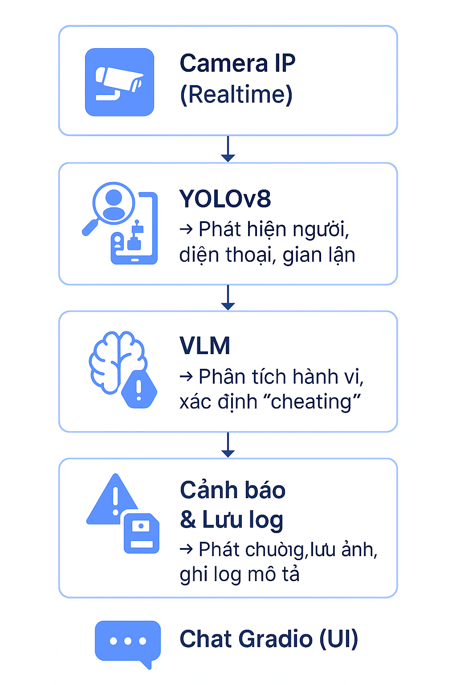

<h2 align="center">
  <a href="https://dainam.edu.vn/vi/khoa-cong-nghe-thong-tin">
  🎓 KHOA CÔNG NGHỆ THÔNG TIN (ĐẠI HỌC ĐẠI NAM) 🎓
  </a>
</h2>

<h2 align="center">
   XÂY DỰNG HỆ THỐNG PHÂN TÍCH GIÁM SÁT HÀNH VI CỦA SINH VIÊN TRONG PHÒNG THI <br>
   DỰA TRÊN MÔ HÌNH NGÔN NGỮ THỊ GIÁC (VLM)
</h2>

<div align="center">
  <p align="center">
    
    
    
  </p>

  <p align="center">
    <a href="https://dainam.edu.vn">
      
    </a>
    <a href="https://dainam.edu.vn/vi/khoa-cong-nghe-thong-tin">
      
    </a>
    <a href="https://www.facebook.com/DNUAIoTLab">
      
    </a>
  </p>

  <p align="center">
    <a href="https://www.python.org/"></a>
    <a href="https://pytorch.org/"></a>
    <a href="https://ultralytics.com/yolov8"></a>
    <a href="https://huggingface.co/Salesforce/blip2-flan-t5-xl"></a>
    <a href="https://flask.palletsprojects.com/"></a>
    <a href="https://gradio.app/"></a>
    <a href="https://opencv.org/"></a>
    
    
    
  </p>

  <p align="center">
    
    
    
  </p>
</div>

---

## 🧭 GIỚI THIỆU HỆ THỐNG

Đề tài tập trung vào việc **phân tích và giám sát hành vi của sinh viên trong phòng thi** bằng cách kết hợp giữa **mô hình thị giác máy tính (YOLOv8)** và **mô hình ngôn ngữ thị giác (VLM – BLIP-2)**.  

Hệ thống được xây dựng nhằm:
- 🎥 Giám sát **video thời gian thực** từ camera IP hoặc webcam.  
- 🔍 Phát hiện **hành vi khả nghi** như: sử dụng điện thoại, nhìn bài người khác, gian lận.  
- 🧠 Phân tích ngữ nghĩa hình ảnh bằng **BLIP-2 Flan-T5-XL** để xác nhận hành vi.  
- 🚨 Phát cảnh báo âm thanh khi phát hiện gian lận.  
- 💾 Lưu lại **ảnh bằng chứng** cùng thời gian và xác suất gian lận.  

---

## 🎯 MỤC TIÊU
- Phát hiện **tự động** hành vi gian lận trong phòng thi.  
- Kết hợp giữa **YOLOv8 (thị giác)** và **BLIP-2 (ngữ nghĩa)**.  
- Sinh báo cáo gồm: ảnh, mô tả hành vi, xác suất, thời gian.  
- Giao diện hiển thị trực quan (Gradio / Flask).  
- Ứng dụng trong các **đồ án chuyển đổi số, nghiên cứu AI giám sát thông minh**.

---

## ⚙️ CÔNG NGHỆ SỬ DỤNG

| Thành phần | Công nghệ | Vai trò |
|-------------|------------|----------|
| Phát hiện đối tượng | **YOLOv8 (Ultralytics)** | Nhận diện người, điện thoại, hành vi bất thường |
| Phân tích ngữ nghĩa ảnh | **BLIP-2 Flan-T5-XL (HuggingFace)** | Mô tả và hiểu ngữ cảnh hành vi |
| Xử lý video | **OpenCV + NumPy** | Đọc luồng, trích khung hình, vẽ bounding box |
| Theo dõi đối tượng | **DeepSort** | Gán ID và theo dõi sinh viên trong khung hình |
| Giao diện demo | **Gradio / Flask** | Hiển thị, tương tác và chạy thử hệ thống |
| Cảnh báo | **winsound (Windows)** | Phát âm báo khi phát hiện gian lận |
| Lưu bằng chứng | **datetime + os** | Lưu log + ảnh vào thư mục `logs/evidence/` |

---

## 🧩 KIẾN TRÚC HỆ THỐNG


<p align="center">
  
</p>


---

## 🚀 CÁCH CHẠY DỰ ÁN

```text
# 1️⃣ Tạo môi trường ảo
python -m venv venv
venv\Scripts\activate        # Windows
# hoặc
source venv/bin/activate     # Linux / macOS

# 2️⃣ Cài đặt thư viện
pip install -r requirements.txt

# 3️⃣ Chạy demo
python Last.py
```
## 🔍 KẾT QUẢ HIỂN THỊ

- 🧾 **Khung người bị phát hiện (YOLOv8)**  
- 💬 **Xác suất gian lận (%)**  
- 📸 **Ảnh bằng chứng lưu tại:** `/logs/evidence/`  
- 🔔 **Âm thanh cảnh báo:** khi xác suất > ngưỡng  
- 🧠 **Mô tả hành vi từ BLIP-2:**  

**Ví dụ:**
> “Student using phone”  
> “Looking at another screen”  
> “Cheating detected”
---

## 🚧 HƯỚNG PHÁT TRIỂN

- 🔬 Nâng cấp mô hình lên LLaVA-Next / Qwen-VL để tăng độ chính xác.

- ⚡ Tối ưu tốc độ bằng TensorRT / ONNX Runtime.

- 🖥️ Xây dựng bảng điều khiển web giám sát nhiều camera song song.

- 🤖 Tích hợp AI cảnh báo tập trung cho nhiều phòng thi.

- 📊 Thêm mô-đun thống kê & quản lý lịch sử log giám sát.

<div align="center">

---
<p align="center">
  
</p>

<h3>
  <a href="https://github.com/VnhPhn"> Phan Đình Quang Vinh </a>
</h3>

<h4>
🎓 Ngành Công nghệ Thông tin – Trường Đại học Đại Nam  
<br>


